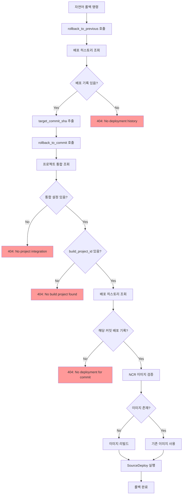

# 롤백 에러 분석 보고서

## 발생한 에러 요약

### 에러 로그
```
2025-10-19 21:07:35 - httpx - INFO - HTTP Request: GET https://contest27-klepaas-build-handle.kr.ncr.ntruss.com/v2/k-le-paas-test01/manifests/c39eb548410f19f42c6dd8fe15966563a9085aca "HTTP/1.1 404 Not Found"
2025-10-19 21:07:35 - app.api.v1.nlp - INFO - K8s 실행 결과: {'status': 'error', 'action': 'ncp_rollback', 'message': 'NCP 롤백 실패: 404: No build project found for K-Le-PaaS/test01'}
```

### 분석

#### 1. 실제 에러 원인
`rollback_to_commit` 함수에서 프로젝트 통합(integration) 조회 시 `build_project_id`가 없어서 발생한 에러입니다.

**에러 발생 위치:** `app/services/rollback.py:73-77` (개선 전)

```python
integ = get_integration(db, user_id=user_id, owner=owner, repo=repo)
if not integ or not integ.build_project_id:
    raise HTTPException(
        status_code=404,
        detail=f"No build project found for {owner}/{repo}"
    )
```

#### 2. 혼란스러운 에러 메시지
- **NCR 404**: NCR에서 이미지를 찾지 못한 것은 맞지만, 이건 예상된 상황이며 자동으로 리빌드됨
- **실제 문제**: "No build project found" - 프로젝트 통합 설정이 없음

#### 3. 근본 원인 체인



## 개선 사항

### 1. 에러 메시지 개선

**개선 전:**
```python
if not integ or not integ.build_project_id:
    raise HTTPException(
        status_code=404,
        detail=f"No build project found for {owner}/{repo}"
    )
```

**개선 후:**
```python
if not integ:
    logger.error(f"No project integration found for {owner}/{repo}")
    raise HTTPException(
        status_code=404,
        detail=f"No project integration found for {owner}/{repo}. Please set up the project first using the deployment API."
    )

if not integ.build_project_id:
    logger.error(f"Build project ID not configured for {owner}/{repo}")
    raise HTTPException(
        status_code=400,
        detail=f"Build project ID not configured for {owner}/{repo}. Please complete project setup."
    )
```

### 2. 로깅 추가

모든 주요 단계에 상세 로깅 추가:

```python
logger.info(f"Starting rollback for {owner}/{repo} to commit {target_commit_sha[:7]}")
logger.info(f"Project integration found: build_project_id={integ.build_project_id}, deploy_project_id={integ.deploy_project_id}")
logger.info(f"Found deployment history: deployed_at={history.deployed_at}, image={history.image_name}")
logger.info(f"Verifying NCR image: {image_url}")
logger.info(f"NCR image verification result: exists={image_exists}, code={verification_code}")
```

### 3. 진단 도구 추가

새로운 `diagnose_rollback_readiness` 함수로 사전 진단 가능:

```python
async def diagnose_rollback_readiness(
    owner: str,
    repo: str,
    db: Session,
    user_id: str
) -> Dict[str, Any]:
    """
    롤백 준비 상태를 진단하고 문제점을 식별합니다.
    """
```

**API 엔드포인트:**
- `POST /api/v1/rollback/diagnose`
- `GET /api/v1/rollback/diagnose/{owner}/{repo}`

### 4. 단계별 검증

롤백 실행 순서 최적화:

**개선 전:**
1. 배포 히스토리 조회
2. NCR 이미지 검증
3. 프로젝트 통합 조회 ← 여기서 실패

**개선 후:**
1. 프로젝트 통합 조회 ← 먼저 검증
2. 배포 히스토리 조회
3. NCR 이미지 검증
4. 롤백 실행

## 해결 방법

### 즉시 조치 사항

현재 `K-Le-PaaS/test01` 프로젝트를 롤백 가능하게 하려면:

```sql
-- 1. 프로젝트 통합 생성 또는 업데이트
INSERT INTO user_project_integrations (
  user_id, github_owner, github_repo,
  sc_project_id, sc_repo_name, branch,
  build_project_id, deploy_project_id,
  created_at, updated_at
) VALUES (
  'nlp_user', 'K-Le-PaaS', 'test01',
  YOUR_SC_PROJECT_ID, 'test01', 'main',
  YOUR_BUILD_PROJECT_ID, YOUR_DEPLOY_PROJECT_ID,
  NOW(), NOW()
)
ON CONFLICT (user_id, github_owner, github_repo)
DO UPDATE SET
  build_project_id = YOUR_BUILD_PROJECT_ID,
  deploy_project_id = YOUR_DEPLOY_PROJECT_ID,
  updated_at = NOW();

-- 2. 배포 히스토리 확인
SELECT github_commit_sha, deployed_at, status
FROM deployment_histories
WHERE github_owner = 'K-Le-PaaS' AND github_repo = 'test01'
  AND status = 'success'
ORDER BY created_at DESC
LIMIT 10;
```

### 장기 개선 사항

1. **프로젝트 설정 자동화**
   - 첫 배포 시 자동으로 프로젝트 통합 생성
   - NCP SourceBuild/SourceDeploy 프로젝트 ID 자동 저장

2. **배포 히스토리 보장**
   - 모든 성공적인 배포에 대해 히스토리 자동 기록
   - 실패한 배포도 별도 상태로 기록

3. **NCR 이미지 관리**
   - 배포 후 이미지 존재 확인
   - 주기적 이미지 정리 정책 수립

## 테스트 시나리오

### 시나리오 1: 정상 롤백

**전제 조건:**
- ✅ 프로젝트 통합 설정 완료
- ✅ 성공적인 배포 기록 2개 이상
- ✅ NCR 이미지 존재

**명령어:**
```
K-Le-PaaS/test01 롤백 해줘
```

**예상 결과:**
```
✅ 롤백 성공: 1번 전 배포로 롤백 완료
```

### 시나리오 2: 통합 설정 없음

**전제 조건:**
- ❌ 프로젝트 통합 없음

**명령어:**
```
K-Le-PaaS/new-project 롤백 해줘
```

**예상 결과:**
```
❌ 에러: No project integration found for K-Le-PaaS/new-project.
   Please set up the project first using the deployment API.
```

### 시나리오 3: 배포 히스토리 없음

**전제 조건:**
- ✅ 프로젝트 통합 설정 완료
- ❌ 배포 기록 없음

**명령어:**
```
K-Le-PaaS/undeployed-project 롤백 해줘
```

**예상 결과:**
```
❌ 에러: No deployment history found for K-Le-PaaS/undeployed-project.
   Deploy the application first before attempting rollback.
```

### 시나리오 4: 이미지 없음 (자동 리빌드)

**전제 조건:**
- ✅ 프로젝트 통합 설정 완료
- ✅ 배포 기록 존재
- ❌ NCR 이미지 없음

**명령어:**
```
K-Le-PaaS/test01 abc1234 커밋으로 롤백
```

**예상 결과:**
```
⚠️  경고: NCR 이미지가 없어 자동으로 리빌드합니다
✅ 롤백 성공: 커밋 abc1234로 롤백 완료 (rebuilt=true)
```

## 참고 자료

- [롤백 문제 해결 가이드](./ROLLBACK_TROUBLESHOOTING.md)
- [롤백 서비스 코드](../app/services/rollback.py)
- [롤백 API 문서](../app/api/v1/rollback.py)
- [NLP 명령 처리](../app/services/commands.py)
