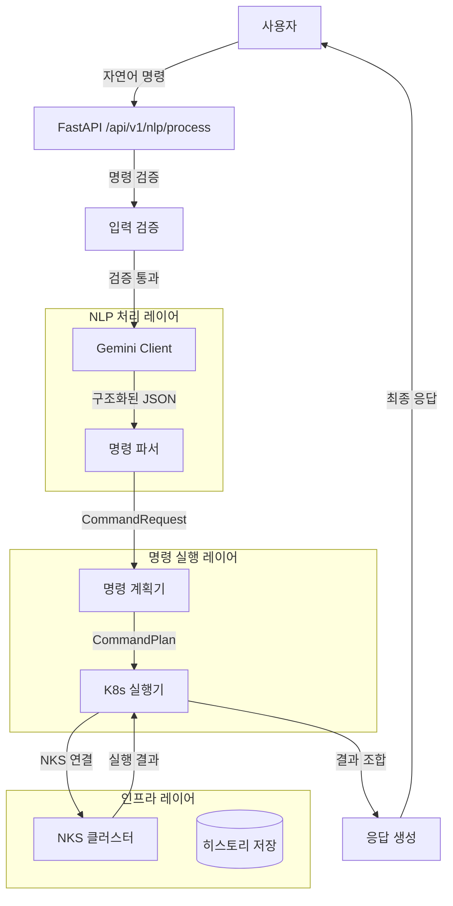
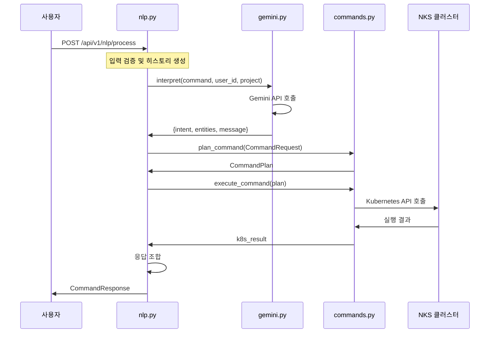

# K-Le-PaaS NLP 실행 아키텍처 및 워커 플로우

## 📋 목차
1. [시스템 개요](#시스템-개요)
2. [아키텍처 다이어그램](#아키텍처-다이어그램)
3. [핵심 컴포넌트](#핵심-컴포넌트)
4. [실행 플로우](#실행-플로우)
5. [API 스펙](#api-스펙)
6. [코드 구조](#코드-구조)
7. [에러 처리](#에러-처리)
8. [성능 최적화](#성능-최적화)
9. [개발 가이드](#개발-가이드)

---

## 🎯 시스템 개요

K-Le-PaaS의 NLP 시스템은 **자연어 명령을 Kubernetes 작업으로 변환**하는 지능형 인터페이스입니다.

### 핵심 특징
- **단일 책임 원칙**: 각 컴포넌트가 명확한 역할 분담
- **실시간 처리**: 비동기 처리로 빠른 응답
- **NKS 연동**: 실제 Kubernetes 클러스터 제어
- **확장 가능**: 새로운 명령어 쉽게 추가 가능

### 지원 명령어
| 명령어 | 설명 | 예시 |
|--------|------|------|
| `status` | 앱 상태 확인 | "nginx 상태 확인해줘" |
| `logs` | 로그 조회 | "nginx 로그 20줄 보여줘" |
| `scale` | 스케일링 | "nginx 스케일 3개로 늘려줘" |
| `restart` | 재시작 | "nginx 재시작해줘" |
| `rollback` | 롤백 | "v1.1 버전으로 롤백해줘" |
| `endpoint` | 엔드포인트 조회 | "nginx 접속 주소 알려줘" |
| `deploy` | 배포 | "배포해줘" |
| `list_pods` | 파드 목록 조회 | "모든 파드 조회해줘" |

---

## 🏗️ 아키텍처 다이어그램

### 전체 시스템 아키텍처


### 컴포넌트 간 상호작용 플로우


---

## 🔧 핵심 컴포넌트

### 1. **nlp.py** - API 엔드포인트 및 오케스트레이션
**역할**: 사용자 요청의 진입점이자 전체 플로우를 조율하는 컨트롤러

**주요 기능**:
- FastAPI 엔드포인트 제공 (`POST /api/v1/nlp/process`)
- 입력 검증 및 보안 체크
- 명령 히스토리 관리
- Gemini와 commands.py 간 브리지 역할

**핵심 메서드**:
```python
@router.post("/nlp/process", response_model=CommandResponse)
async def process_command(command_data: NaturalLanguageCommand):
    # 1. 입력 검증
    # 2. Gemini 호출
    # 3. CommandRequest 생성
    # 4. commands.py 실행
    # 5. 응답 조합
```

### 2. **gemini.py** - 자연어 해석 엔진
**역할**: 자연어를 구조화된 명령어로 변환하는 AI 인터페이스

**주요 기능**:
- Gemini API 직접 호출
- 시스템 프롬프트 기반 명령 해석
- JSON 응답 파싱 및 검증
- 에러 처리 및 폴백

**핵심 메서드**:
```python
async def interpret(self, prompt: str, user_id: str, project_name: str) -> Dict[str, Any]:
    # 1. Gemini API 호출
    # 2. 응답 파싱
    # 3. entities 변환
    # 4. 메시지 생성
```

### 3. **commands.py** - Kubernetes 명령 실행기
**역할**: 구조화된 명령을 실제 Kubernetes API 호출로 변환

**주요 기능**:
- CommandRequest → CommandPlan 변환
- Kubernetes API 호출 실행
- 결과 집계 및 에러 처리
- NKS 클러스터 연결 관리

**핵심 메서드**:
```python
def plan_command(req: CommandRequest) -> CommandPlan:
    # 명령 타입에 따른 실행 계획 생성

async def execute_command(plan: CommandPlan) -> Dict[str, Any]:
    # 실제 Kubernetes API 호출 실행
```

### 4. **k8s_client.py** - Kubernetes 클라이언트
**역할**: NKS 클러스터와의 연결 및 API 클라이언트 제공

**주요 기능**:
- kubeconfig 파일 로드
- API 클라이언트 인스턴스 생성
- 연결 상태 관리

---

## 🔄 실행 플로우

### 상세 실행 단계

#### 1단계: 요청 수신 및 검증
```python
# nlp.py - process_command()
command = command_data.command.strip()

# 검증 로직
if not command:
    raise HTTPException(status_code=400, detail="명령을 입력해주세요.")

if len(command) < 3 or len(command) > 500:
    raise HTTPException(status_code=400, detail="명령 길이 오류")

# 위험한 명령어 체크
dangerous_keywords = ['rm -rf', 'sudo', 'kill', 'format', 'delete all']
if any(keyword in command.lower() for keyword in dangerous_keywords):
    raise HTTPException(status_code=400, detail="위험한 명령어 포함")
```

#### 2단계: 자연어 해석 (Gemini)
```python
# nlp.py → gemini.py
gemini_result = await gemini_client.interpret(
    prompt=command,
    user_id="api_user",
    project_name=command_data.context.get("project_name", "default")
)

# 예상 응답 구조
{
    "intent": "status",
    "entities": {
        "app_name": "nginx",
        "replicas": 1,
        "lines": 30,
        "version": ""
    },
    "message": "상태 확인 명령을 해석했습니다.",
    "llm": {
        "provider": "gemini",
        "model": "gemini-2.0-flash",
        "mode": "interpretation_only"
    }
}
```

#### 3단계: 명령 계획 수립
```python
# nlp.py → commands.py
req = CommandRequest(
    command=intent,
    app_name=entities.get("app_name") or "",
    replicas=entities.get("replicas", 1),
    lines=entities.get("lines", 30),
    version=entities.get("version") or ""
)

plan = plan_command(req)
# 예상 결과: CommandPlan(tool='k8s_get_status', args={'name': 'nginx', 'namespace': 'default'})
```

#### 4단계: Kubernetes 실행
```python
# commands.py - execute_command()
k8s_result = await execute_command(plan)

# 실제 K8s API 호출 예시
apps_v1 = get_apps_v1_api()
deployment = apps_v1.read_namespaced_deployment(name='nginx', namespace='default')
core_v1 = get_core_v1_api()
pods = core_v1.list_namespaced_pod(namespace='default', label_selector='app=nginx')
```

#### 5단계: 응답 조합 및 반환
```python
# nlp.py - 최종 응답 생성
result = {
    "message": gemini_result.get("message", "명령이 완료되었습니다."),
    "action": gemini_result.get("intent", "unknown"),
    "entities": entities,
    "k8s_result": k8s_result  # 실제 K8s 작업 결과
}

return CommandResponse(
    success=True,
    message="명령이 성공적으로 처리되었습니다.",
    data=result
)
```

---

## 📡 API 스펙

### 요청 형식
```http
POST /api/v1/nlp/process
Content-Type: application/json

{
  "command": "nginx 상태 확인해줘",
  "timestamp": "2025-10-12T00:50:00Z",
  "context": {
    "project_name": "test"
  }
}
```

### 응답 형식
```json
{
  "success": true,
  "message": "명령이 성공적으로 처리되었습니다.",
  "data": {
    "message": "상태 확인 명령을 해석했습니다.",
    "action": "status",
    "entities": {
      "app_name": "nginx",
      "replicas": 1,
      "lines": 30,
      "version": ""
    },
    "k8s_result": {
      "status": "success",
      "deployment": {
        "name": "nginx",
        "ready_replicas": 3,
        "total_replicas": 3,
        "status": "available"
      },
      "pods": [
        {
          "name": "nginx-xxx-1",
          "status": "Running",
          "ready": "1/1"
        }
      ]
    }
  },
  "error": null
}
```

### 에러 응답 형식
```json
{
  "success": false,
  "message": "명령 처리 중 오류가 발생했습니다.",
  "data": null,
  "error": "Deployment 'nginx'을 찾을 수 없습니다."
}
```

---

## 📁 코드 구조

### 파일별 역할 및 위치
```
app/
├── api/v1/
│   └── nlp.py              # API 엔드포인트 및 오케스트레이션
├── llm/
│   ├── gemini.py           # Gemini API 클라이언트
│   └── interfaces.py       # LLM 인터페이스 정의
├── services/
│   ├── commands.py         # Kubernetes 명령 실행기
│   └── k8s_client.py       # K8s 클라이언트 관리
└── core/
    └── config.py           # 설정 관리
```

### 주요 클래스 및 모델

#### nlp.py
```python
class NaturalLanguageCommand(BaseModel):
    command: str
    timestamp: str
    context: Optional[Dict[str, Any]] = None

class CommandResponse(BaseModel):
    success: bool
    message: str
    data: Optional[Dict[str, Any]] = None
    error: Optional[str] = None

class CommandHistory(BaseModel):
    id: str
    command: str
    timestamp: datetime
    status: str
    result: Optional[Dict[str, Any]] = None
    error: Optional[str] = None
```

#### commands.py
```python
class CommandRequest(BaseModel):
    command: str = Field(min_length=1)
    app_name: str = Field(default="")
    replicas: int = Field(default=1)
    lines: int = Field(default=30)
    version: str = Field(default="")

@dataclass
class CommandPlan:
    tool: str
    args: Dict[str, Any]
```

---

## ⚠️ 에러 처리

### 에러 처리 계층

#### 1. API 레벨 에러 (nlp.py)
```python
try:
    # 전체 처리 로직
except HTTPException:
    raise  # FastAPI 에러는 그대로 전파
except Exception as e:
    logger.error(f"명령 처리 실패: {str(e)}")
    return CommandResponse(
        success=False,
        message="명령 처리 중 오류가 발생했습니다.",
        error=str(e)
    )
```

#### 2. Gemini API 에러 (gemini.py)
```python
try:
    gemini_response = await self._call_gemini_api(prompt)
except Exception as e:
    return {
        "intent": "error",
        "entities": {},
        "error": str(e),
        "message": f"명령 해석 중 오류가 발생했습니다: {str(e)}"
    }
```

#### 3. Kubernetes API 에러 (commands.py)
```python
try:
    deployment = apps_v1.read_namespaced_deployment(name=name, namespace=namespace)
except ApiException as e:
    if e.status == 404:
        return {"status": "error", "message": f"Deployment '{name}'을 찾을 수 없습니다."}
    return {"status": "error", "message": f"Kubernetes API 오류: {e.reason}"}
```

### 에러 타입별 처리

| 에러 타입 | 처리 방식 | 사용자 메시지 |
|-----------|-----------|---------------|
| 입력 검증 실패 | 400 Bad Request | 구체적인 검증 실패 이유 |
| Gemini API 실패 | 500 Internal Server Error | "명령 해석 중 오류 발생" |
| K8s API 실패 | 200 OK (내부 에러) | "Deployment를 찾을 수 없습니다" |
| 시스템 에러 | 500 Internal Server Error | "시스템 오류가 발생했습니다" |

---

## 🚀 성능 최적화

### 비동기 처리
- **FastAPI**: 모든 엔드포인트가 `async/await` 패턴 사용
- **httpx**: Gemini API 호출을 비동기로 처리
- **Kubernetes Client**: 동기 클라이언트이지만 비동기 래퍼로 처리

### 캐싱 전략
```python
# 명령 히스토리 (메모리 기반)
command_history: List[CommandHistory] = []

# 향후 개선: Redis 캐싱
# - Gemini 응답 캐싱
# - K8s 상태 정보 캐싱
# - 사용자 세션 캐싱
```

### 타임아웃 설정
```python
# Gemini API 호출
async with httpx.AsyncClient() as client:
    response = await client.post(url, timeout=30.0)

# Kubernetes API 호출 (기본 60초)
```

### 리소스 최적화
- **연결 풀링**: httpx AsyncClient 재사용
- **메모리 관리**: 히스토리 크기 제한
- **로깅 최적화**: 구조화된 로깅으로 성능 모니터링

---

## 🛠️ 개발 가이드

### 새로운 명령어 추가하기

#### 1단계: Gemini 시스템 프롬프트 업데이트
```python
# gemini.py - _call_gemini_api()
system_prompt = """
9. 새로운 명령어 (command: "new_command")
설명: 새로운 기능에 대한 설명
사용자 입력 예시: "예시 명령어"
필수 JSON 형식: { "command": "new_command", "parameters": { "param": "value" } }
"""
```

#### 2단계: commands.py에 실행 로직 추가
```python
# commands.py - plan_command()
elif command == "new_command":
    return CommandPlan(
        tool="k8s_new_command",
        args={"param": req.param, "namespace": ns}
    )

# commands.py - execute_command()
if plan.tool == "k8s_new_command":
    return await _execute_new_command(plan.args)

# commands.py - 실행 함수 구현
async def _execute_new_command(args: Dict[str, Any]) -> Dict[str, Any]:
    """새로운 명령어 실행 로직"""
    try:
        # K8s API 호출 로직
        return {"status": "success", "result": "..."}
    except Exception as e:
        return {"status": "error", "message": str(e)}
```

#### 3단계: gemini.py 메시지 맵 업데이트
```python
# gemini.py - interpret()
messages = {
    # ... 기존 메시지들
    "new_command": "새로운 명령을 해석했습니다."
}
```

### 테스트 방법

#### 1. 단위 테스트
```python
# tests/test_nlp_commands.py
def test_new_command_parsing():
    gemini_client = GeminiClient()
    result = await gemini_client.interpret("새로운 명령어 테스트")
    assert result["intent"] == "new_command"
```

#### 2. 통합 테스트
```bash
curl -X POST "http://127.0.0.1:8000/api/v1/nlp/process" \
     -H "Content-Type: application/json" \
     -d '{
       "command": "새로운 명령어 테스트",
       "timestamp": "2025-10-12T00:50:00Z"
     }'
```

### 디버깅 가이드

#### 로그 레벨별 정보
```python
# nlp.py
logger.info(f"자연어 명령 처리 시작: {command}")
logger.info(f"Gemini 해석 결과: {gemini_result}")
logger.info(f"CommandRequest 생성: {req}")
logger.info(f"K8s 실행 결과: {k8s_result}")

# commands.py
logger.info(f"명령 실행: {plan.tool} with args: {plan.args}")
logger.error(f"Kubernetes API 오류: {e.reason}")
```

#### 환경 변수 설정
```bash
# .env 파일
KLEPAAS_GEMINI_API_KEY=your_gemini_api_key
KLEPAAS_K8S_CONFIG_FILE=/path/to/nks-kubeconfig.yaml
KLEPAAS_K8S_STAGING_NAMESPACE=default
```

### 모니터링 및 메트릭

#### 성능 지표
- **응답 시간**: Gemini API + K8s API 호출 시간
- **성공률**: 명령 처리 성공/실패 비율
- **에러율**: 각 단계별 에러 발생률

#### 알림 설정
```python
# 향후 개선: 모니터링 시스템 연동
# - Gemini API 실패 알림
# - K8s 연결 실패 알림
# - 응답 시간 임계값 초과 알림
```

---

## 📚 참고 자료

### 관련 문서
- [NLP 아키텍처 리팩터링](./NLP_ARCHITECTURE_REFACTOR.md)
- [환경 설정 가이드](../ENVIRONMENT_AND_CONFIG.md)
- [Kubernetes 설정](./KUBERNETES_CONFIG.md)

### 외부 의존성
- **FastAPI**: 웹 프레임워크
- **Gemini API**: 자연어 처리
- **Kubernetes Python Client**: K8s API 호출
- **httpx**: 비동기 HTTP 클라이언트

### 버전 정보
- **Python**: 3.13+
- **FastAPI**: 0.104+
- **Kubernetes Client**: 28.1+
- **httpx**: 0.25+

---

## 🔄 업데이트 이력

| 버전 | 날짜 | 변경사항 |
|------|------|----------|
| 1.0.0 | 2025-10-12 | 초기 NLP 아키텍처 구현 |
| 1.1.0 | 2025-10-12 | list_pods 명령어 추가 |
| 1.2.0 | 2025-10-12 | 상세 문서화 완료 |

---

**작성자**: AI Assistant  
**최종 수정**: 2025-10-12  
**검토 상태**: 팀 리뷰 대기
