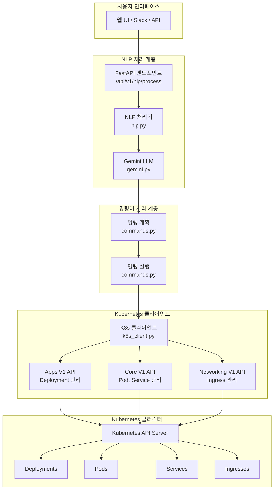

# NLP 실행 아키텍처

> **목적**: NLP 시스템의 전체 아키텍처와 실행 흐름을 상세히 설명하는 문서

---

## 📋 목차
1. [시스템 개요](#시스템-개요)
2. [아키텍처 다이어그램](#아키텍처-다이어그램)
3. [핵심 컴포넌트](#핵심-컴포넌트)
4. [실행 흐름](#실행-흐름)
5. [데이터 모델](#데이터-모델)
6. [에러 처리](#에러-처리)
7. [성능 최적화](#성능-최적화)
8. [보안 고려사항](#보안-고려사항)

---

## 🎯 시스템 개요

### **NLP Kubernetes 관리 시스템**
K-Le-PaaS의 NLP 시스템은 사용자의 자연어 명령을 Kubernetes 클러스터 관리 작업으로 변환하는 지능형 시스템입니다.

### **주요 특징**
- **자연어 이해**: Gemini LLM을 활용한 고도화된 자연어 처리
- **14가지 명령어**: 포괄적인 Kubernetes 리소스 관리
- **실시간 처리**: 빠른 응답과 실시간 상태 조회
- **에러 복구**: 상세한 에러 메시지와 복구 가이드
- **확장성**: 새로운 명령어 추가 용이

---

## 🏗️ 아키텍처 다이어그램



---

## 🔧 핵심 컴포넌트

### **1. API 엔드포인트 (`app/api/v1/nlp.py`)**

#### **역할**
- 사용자 요청 수신 및 검증
- NLP 처리 오케스트레이션
- 응답 포맷팅 및 반환

#### **주요 기능**
```python
@router.post("/process")
async def process_nlp_command(request: NLPRequest):
    # 1. 입력 검증
    validate_command(request.command)
    
    # 2. NLP 처리
    result = await nlp_service.process(request)
    
    # 3. 응답 반환
    return NLPResponse(
        success=True,
        data=result
    )
```

### **2. Gemini LLM 클라이언트 (`app/llm/gemini.py`)**

#### **역할**
- 자연어 명령 해석
- 구조화된 JSON 변환
- 14가지 명령어 패턴 인식

#### **주요 기능**
```python
class GeminiClient:
    async def interpret(self, command: str) -> Dict[str, Any]:
        # 1. 시스템 프롬프트 구성
        system_prompt = self._build_system_prompt()
        
        # 2. Gemini API 호출
        response = await self._call_gemini_api(command, system_prompt)
        
        # 3. JSON 파싱 및 검증
        return self._parse_response(response)
```

### **3. 명령어 처리기 (`app/services/commands.py`)**

#### **역할**
- 명령어 계획 수립
- Kubernetes API 호출
- 결과 데이터 가공

#### **주요 기능**
```python
def plan_command(req: CommandRequest) -> CommandPlan:
    # 명령어별 실행 계획 생성
    
async def execute_command(plan: CommandPlan) -> Dict[str, Any]:
    # 실제 Kubernetes 작업 실행
```

### **4. Kubernetes 클라이언트 (`app/services/k8s_client.py`)**

#### **역할**
- Kubernetes API 클라이언트 관리
- 연결 설정 및 인증
- API 호출 최적화

#### **주요 기능**
```python
def get_core_v1_api(context: Optional[str] = None) -> client.CoreV1Api:
    # Core V1 API 클라이언트 반환

def get_apps_v1_api(context: Optional[str] = None) -> client.AppsV1Api:
    # Apps V1 API 클라이언트 반환

def get_networking_v1_api(context: Optional[str] = None) -> client.NetworkingV1Api:
    # Networking V1 API 클라이언트 반환
```

---

## 🔄 실행 흐름

### **1. 요청 수신 단계**
```python
# 사용자 자연어 입력
command = "nginx 상태 확인해줘"

# API 요청 구성
request = NLPRequest(
    command=command,
    timestamp="2025-10-13T11:20:00Z",
    context={"project_name": "test"}
)
```

### **2. NLP 처리 단계**
```python
# Gemini LLM 해석
interpretation = await gemini_client.interpret(command)
# 결과: {"command": "status", "parameters": {"appName": "nginx", "namespace": "default"}}

# CommandRequest 생성
command_req = CommandRequest(
    command="status",
    app_name="nginx",
    namespace="default",
    replicas=1,
    lines=30,
    version="",
    previous=False
)
```

### **3. 명령 계획 단계**
```python
# 실행 계획 수립
plan = plan_command(command_req)
# 결과: CommandPlan(tool="k8s_get_status", args={"name": "nginx", "namespace": "default"})
```

### **4. Kubernetes 실행 단계**
```python
# Kubernetes API 호출
result = await execute_command(plan)

# Apps V1 API로 Deployment 조회
apps_v1 = get_apps_v1_api()
deployment = apps_v1.read_namespaced_deployment(name="nginx", namespace="default")

# Core V1 API로 Pod 조회
core_v1 = get_core_v1_api()
pods = core_v1.list_namespaced_pod(namespace="default", label_selector="app=nginx")
```

### **5. 응답 구성 단계**
```python
# 결과 데이터 가공
response_data = {
    "status": "success",
    "deployment": {
        "name": "nginx",
        "replicas": {"desired": 1, "current": 1, "ready": 1, "available": 1},
        "image": "nginx:1.21",
        "status": "Running"
    },
    "pods": [
        {
            "name": "nginx-xxx-1",
            "phase": "Running",
            "ready": "1/1",
            "restarts": 0
        }
    ]
}

# 최종 응답 반환
return NLPResponse(
    success=True,
    message="명령이 성공적으로 처리되었습니다.",
    data=response_data
)
```

---

## 📊 데이터 모델

### **1. 입력 데이터 모델**
```python
class NLPRequest(BaseModel):
    command: str = Field(min_length=1, max_length=1000)
    timestamp: str
    context: Dict[str, Any] = Field(default_factory=dict)
```

### **2. 중간 데이터 모델**
```python
class CommandRequest(BaseModel):
    command: str = Field(min_length=1)
    app_name: str = Field(default="")
    replicas: int = Field(default=1)
    lines: int = Field(default=30, ge=1, le=100)
    version: str = Field(default="")
    namespace: str = Field(default="default")
    previous: bool = Field(default=False)

@dataclass
class CommandPlan:
    tool: str
    args: Dict[str, Any]
```

### **3. 출력 데이터 모델**
```python
class NLPResponse(BaseModel):
    success: bool
    message: str
    data: Dict[str, Any] = Field(default_factory=dict)
    error: Optional[str] = None
```

---

## ⚠️ 에러 처리

### **1. 입력 검증 에러**
```python
# 명령어 길이 초과
if len(command) > 1000:
    raise HTTPException(status_code=400, detail="명령어가 너무 깁니다.")

# 로그 줄 수 초과
if req.lines > 100:
    raise HTTPException(status_code=400, detail="로그 줄 수는 최대 100줄까지 조회 가능합니다.")
```

### **2. Gemini API 에러**
```python
try:
    response = await gemini_client.interpret(command)
except Exception as e:
    return {
        "success": False,
        "error": f"자연어 처리 실패: {str(e)}"
    }
```

### **3. Kubernetes API 에러**
```python
try:
    deployment = apps_v1.read_namespaced_deployment(name=name, namespace=namespace)
except ApiException as e:
    if e.status == 404:
        return {
            "status": "error",
            "message": f"Deployment '{name}'을 찾을 수 없습니다."
        }
    return {
        "status": "error",
        "message": f"Kubernetes API 오류: {e.reason}"
    }
```

---

## 🚀 성능 최적화

### **1. API 클라이언트 재사용**
```python
# 싱글톤 패턴으로 API 클라이언트 재사용
@lru_cache(maxsize=1)
def get_apps_v1_api() -> client.AppsV1Api:
    return client.AppsV1Api()
```

### **2. 병렬 처리**
```python
# 여러 리소스 동시 조회
async def get_overview_data(namespace: str):
    apps_v1 = get_apps_v1_api()
    core_v1 = get_core_v1_api()
    networking_v1 = get_networking_v1_api()
    
    # 병렬로 리소스 조회
    deployments_task = asyncio.create_task(get_deployments(apps_v1, namespace))
    pods_task = asyncio.create_task(get_pods(core_v1, namespace))
    services_task = asyncio.create_task(get_services(core_v1, namespace))
    ingresses_task = asyncio.create_task(get_ingresses(networking_v1, namespace))
    
    # 모든 결과 대기
    deployments, pods, services, ingresses = await asyncio.gather(
        deployments_task, pods_task, services_task, ingresses_task
    )
```

### **3. 캐싱 전략**
```python
# 네임스페이스 목록 캐싱 (5분)
@cache(ttl=300)
async def get_namespace_list():
    core_v1 = get_core_v1_api()
    return core_v1.list_namespace()
```

---

## 🔒 보안 고려사항

### **1. 입력 검증**
```python
# 위험한 명령어 차단
dangerous_keywords = ["rm", "delete", "kill", "shutdown"]
if any(keyword in command.lower() for keyword in dangerous_keywords):
    raise HTTPException(status_code=400, detail="위험한 명령어가 감지되었습니다.")
```

### **2. Kubernetes RBAC**
```python
# 필요한 최소 권한만 부여
# - get, list: 조회 명령어
# - patch: restart, scale 명령어
# - create: deploy 명령어
```

### **3. API 키 보안**
```python
# Gemini API 키 환경변수 관리
GEMINI_API_KEY = os.getenv("GEMINI_API_KEY")
if not GEMINI_API_KEY:
    raise ValueError("GEMINI_API_KEY 환경변수가 설정되지 않았습니다.")
```

---

## 📈 모니터링 및 로깅

### **1. 구조화된 로깅**
```python
import structlog

logger = structlog.get_logger()

# 명령어 실행 로깅
logger.info(
    "command_executed",
    command=req.command,
    app_name=req.app_name,
    namespace=req.namespace,
    execution_time=execution_time
)
```

### **2. 메트릭 수집**
```python
# Prometheus 메트릭
from prometheus_client import Counter, Histogram

command_counter = Counter('nlp_commands_total', 'Total NLP commands', ['command', 'status'])
command_duration = Histogram('nlp_command_duration_seconds', 'Command execution time', ['command'])
```

---

## 🔄 업데이트 이력

| 버전 | 날짜 | 변경사항 |
|------|------|----------|
| 1.0.0 | 2025-10-12 | 초기 아키텍처 문서 작성 |
| 2.0.0 | 2025-10-13 | 14개 명령어 아키텍처로 확장, 코드리뷰 반영 |

---

**작성자**: AI Assistant  
**최종 수정**: 2025-10-13  
**다음 업데이트**: 새로운 컴포넌트 추가 시